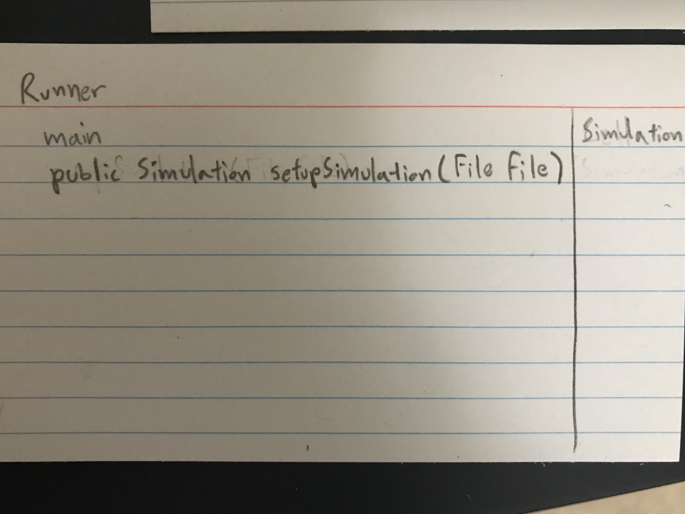
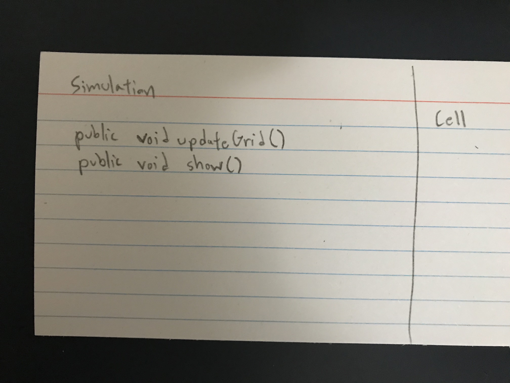
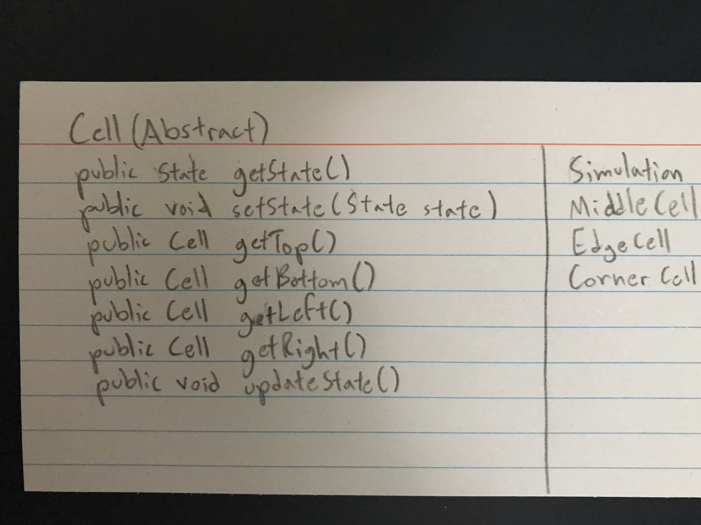
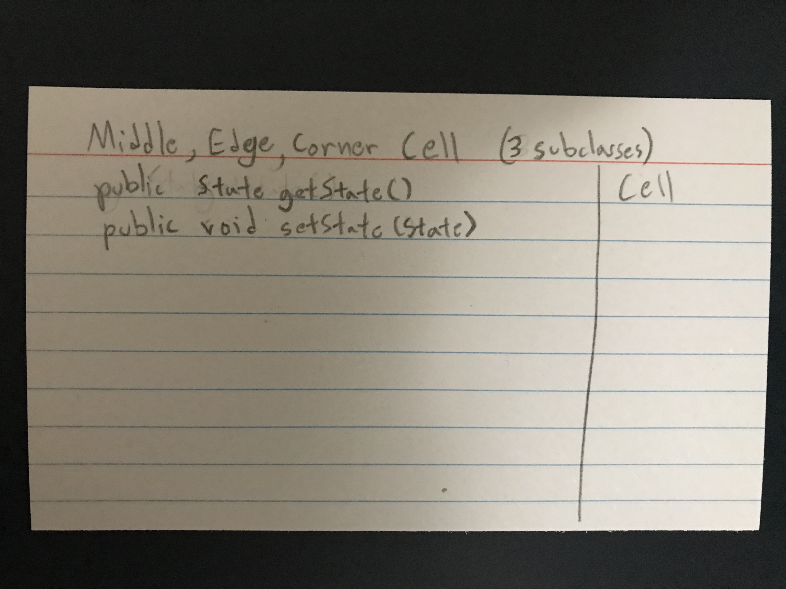

#### Simulation Design Plan
### Team Number: 18
### Names: Thomas Chemmanoor, Vineet Alaparthi, Rodrigo Araujo

## Introduction
We need to create a general Cellular automata program that can run any of the five CA programs given to us. The primary architecture
of the design is broken up into three parts: simulation, configuration, visualization. Simulation should be open since we need it 
to work with different types of rules. The simulation is where the code needs to be the most flexible. Configuration should be closed 
since its operation is the same everytime. Visualization needs to be closed because it will be the same everytime. 

## Overview

    
* We plan to have a runner class that should just have a main method, setupSimulation
    * The runner class would do the configuration of the simulation with the setupSimulation method.
    * It's main method would start and update the simulation, and graphically visualize the simulation to the user. 
    
* Simulation class that will contain the rules of the simulation and a constructor, updateGrid method, and a show method.
    * We will have to create an object inside the runner class for the actual simulation to start.
    
* We plan to also have an abstract Cell class that has the methods:
    * getState
    * setState
    * getTopCell
    * getBottomCell
    * getLeftCell
    * getRightCell
    * updateState
    
We also need a Middle Cell, Edge Cell, and Corner Cell that will extend from the abstract Cell class.

* Two different implementations:
    * 1. the grid is 2d array
    * 2. the grid is map
        * To make our program as flexible as possible, grid, regardless of its data structure will be made in the simulation class so 
        any methods in the simulation that need to use the grid would not need to pass in the grid. No method signatures in our program
        will need to pass in grid since all methods that need to use grid will be inside the simulation class and have access to the 
        private variable.
        
       
        
        public void setupSimulation (File file) {}
            returns a variable of type simulation that has the grid in the runner class associated to it
        

## User Interface 

    User will be presented with a screen that shows a grid of all cells. User has a text field that they can write a file name and click a 
    button near the textfield to load that file to restart the simulation. We will have a button for pausing, and a button for resuming
    the simulation. We will also need a button to step through the simulation. We would need three buttons that allow the user to 
    pick the simulation's speed.
    
    Erroneous situations that will be reported to the user:
        When user loads file that does not exist. 

## Design Details
    
* We plan to have a runner class that should just have a main method, setupSimulation
    *The runner class would do the configuration of the simulation with the setupSimulation method.
    *It would update the simulation with setter methods and simulation's updateGrid method, and graphically visualize 
    the simulation to the user using simulation's show method. 
    
    *Simulation class that will contain the rules of the simulation and a constructor, updateGrid method, and a show method.
    *We will have to create an object inside the runner class for the actual simulation to start.
    *Once started to update the simulation with the UI's button presses, the code will utilize simulation setter methods for data elemtents
    within the simulation class. To add additional updates, one only needs to create a new variable inside of the simulation class and
    make a setter method for that variable.
    
We plan to also have an abstract Cell class that has the methods:
    *getState
    *setState
    *getTopCell
    *getBottomCell
    *getLeftCell
    *getRightCell
    *updateState
We also need a Middle Cell, Edge Cell, and Corner Cell that will extend from the abstract Cell class.

* Middle Cell will have a constructor
    * variables:
        *TopCell
        *BottomCell
        *LeftCell
        *RightCell
    *updateState will factor in all neighbors
    
Edge Cell will have a constructor
    * variables:
        *TopCell
        *BottomCell
        *LeftCell
        *RightCell
    * 1 cell will be set to null depending on the constructor and 3 cells will point to an actual cell.
    updateState will factor in 3 neighbors
        
Corner Cell will have a constructor
    variables:
        TopCell
        BottomCell
        LeftCell
        RightCell
    2 cells will be set to null depending on the constructor and 2 cells will point to an actual cell.
    updateState will factor in 2 neighbors

If we need to add a new type of cell then we could create that specific type of cell and make it extend the abstract class Cell.

### Use Cases
* Apply the rules to a middle cell: set the next state of a cell to dead by counting its number of neighbors using the Game of Life rules for a cell in the middle (i.e., with all its neighbors)

* This will be completed by using the Middle Cell's own updateState method. Since a middle cell has 4 neighbors, the updateState 
    method will look at all 4 neighbors.
    
* Apply the rules to an edge cell: set the next state of a cell to live by counting its number of neighbors using the Game of Life rules for a cell on the edge (i.e., with some of its neighbors missing)
 
   * This will be completed by using the Edge Cell's own updateState method. Since a edge cell has 3 neighbors, the updateState 
    method will look at all 3 neighbors.
    
*Move to the next generation: update all cells in a simulation from their current state to their next state and display the result graphically

* Inside the runner class the current simulation will use its updateGrid method to update the state of all cells
    and use the show method to show the state of all cells graphically.
    
* Set a simulation parameter: set the value of a global configuration parameter, probCatch, for a simulation, Fire, based on the value given in an XML fire

* This will happen inside the setupSimulation method inside of the runner class. Reading values from the XML file, it will create
    a new simulation object. If you are updating a simulation parameter as the simulation is running then you can use the various set methods
    for a simulation's variables to update the current simulation.
    
* Switch simulations: load a new simulation from an XML file, stopping the current running simulation, Segregation, and starting the newly loaded simulation, Wator
    
* To load up a new simulation, we would call the setupSimulation method and make the current simulation = to the result of the method.

* We are creating 3 different types of cells because their update methods will be unique to them since all three do not share the same
    number of neighbors. Since they do share common methods they will all extend an abstract Cell class. This demonstrates Polymorphism and
    inheritance.
    
* We will be creating a simulation class that has all of its pertinent data elements within itself which demonstrates encapsulation and
    open/closed design. The runner class seperates the configuration of the simulation from the rest of the program to demonstrate
    SHY programming.
    

    
## Design Considerations
    Issues which need to be addressed or resolved before attempting to devise a complete design solution:
        Figuring out which neighbor/s an edge or corner cell will be missing to create the cell

    Design Decisions:
        Runner class and Simulation class vs. One Runner class
            Runner class and Simulation class
                Pros: Uses encapsulation and open/close design, makes code readable, simpler to think about
                Cons: more lines of code, slightly more complicated in passing method arguments
            
            One Runner class
                Pros: less files, never having variable scope issues 
                Cons: way less organized
                
        Reading file within separate method inside the runner class vs. inside the main method
            Reading file within separate method inside the runner class
                Pros: Uses encapsulation and open/close design, makes code readable
                Cons: more lines of code
            
            Reading file inside the main method
                Pros: less lines of code
                Cons: not readable, not modular
                
        One non-abstract cell vs Abstract cell with extended specific cells
            One non-abstract cell
                Pros: design is simpler (less files)
                Cons: having to create a general update method that would work for all types of cells
            
            Abstract cell with extended specific cells
                Pros: Allows for easier conceptualization, easier creation of specific update method
                    uses Polymorphism and inheritance
                Cons: design will be more complex (more files)
            
    Assumption/Dependencies
        Assuming the file format will generally be the same
        Assuming the grid will not be big enough to extend past someone's laptop screen
        Assuming the grid will always be 2 dimensional
        

## Team Responsibilities

 * Team Member #1 Thomas Chemmanoor 
 *  Primary: Visualization
 *  Secondary: Implementating Cell class structure

 * Team Member #2 Rodrigo Araujo-
 *  Primary: Simulation
 *  Secondary: Methods for updating the simulation

 * Team Member #3 Vineet Alaparthi
 * Primary: Configuration
 * Secondary: 

